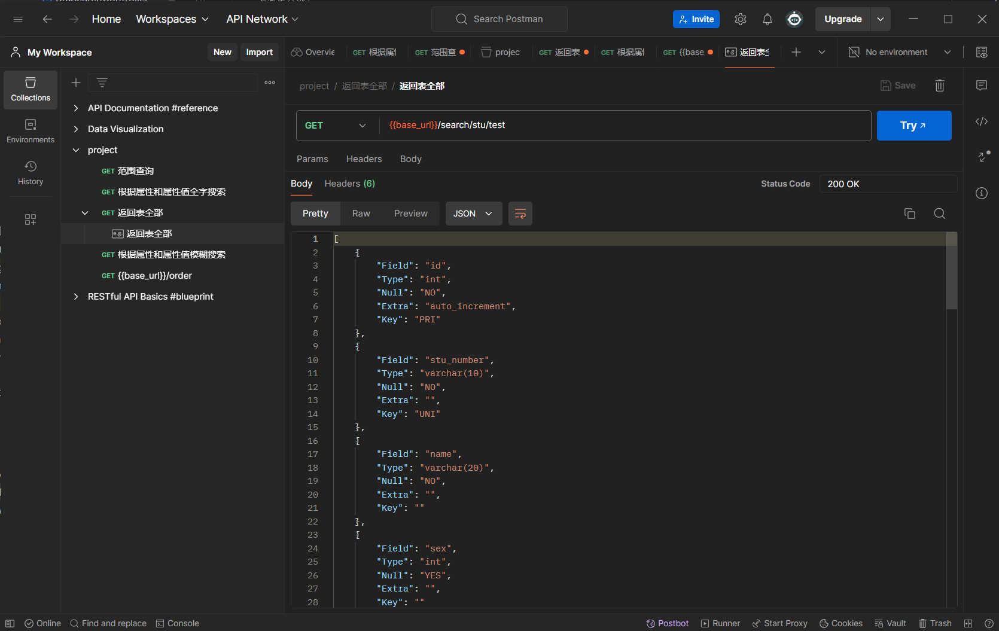

public class StuInfo {
表名stu_info
//学生信息
    Long id;			            //记录id，自增长可不传数据(主键)
    String stuNumber;		        //学号
    String name;			        //名字
    Integer sex;			        //性别，男1女0
    String category;			    //学生类别
    String ethnicity;			    //民族
    String idNumber;			    //身份证号
    Date  birthday;			        //生日
    String className;		        //班级
    String eduLevel;                //培养层次
    String politicalStatus;         //政治面貌
    String dormitory;               //宿舍
    String nativePlace;             //籍贯
    String contact;                 //联系方式
    String address;                 //家庭地址
    String emergencyContactName;    //紧急联系人邢敏
    String emergencyContactPhone;   //紧急联系人电话
    String Wechat;                  //微信
    String emailAdr;                //邮箱地址
}

public class ApiInfo {
表名api
//api信息
    Long id;                     //api序号(主键)
    String name;                 //api名字
    String url;                     //url
    String apiInfo;                 //api介绍/信息
    String command;                 //sql语句
    String flowControl;             //流量控制
    Integer status;                 //状态0运行1停用2限流
    Long viewCount;                 //访问次数
}

public class ApiRecord {
表名api_record
//api记录
    Long id;                        //api序号(主键)
    String name;                    //api名字
    DateTime time;                  //访问时间
    String ip;                      //访问ip
}

public class ReportInfo {
//报表信息
    Long id;                        //报表序号(主键)
    String repName;                 //报表名字
    String url;                     //url
    String repInfo;                 //报表介绍/信息
    String flowControl;             //流量控制
    Integer status;                 //状态0运行1停用2限流
    Long viewCount;                 //访问次数
}

public class UserInfo {
//管理员信息
    Long id;                    //用户ID(主键)
    String account;                 //用户账号
    String password;                //用户密码
    Integer status;                 //状态0运行1停用
    String token;                   //Token
    Long viewCount;                 //访问次数
}

base_url为服务器地址
{{base_url}} : base_url:10010

Search:
    返回表全部:
    Get {{base_url}}/search/表名
    范围查询:
    Get {{base_url}}/search/{表名}/range/{属性名}/{最小值}/{最大值}
    根据属性和属性值全字搜索:
    Get {{base_url}}/search/{表名}/0/normal/{属性名}/{值}
    根据属性和属性值模糊搜索:
    Get {{base_url}}/search/{表名}/1/normal/{属性名}/{值}
    获得表名的所有属性名:
    Get {{base_url}}/search/{表名}/attribute                      返回类型为List<Map<String, Object>>具体长什么样/怎么处理可以问GPT
    样例如下:
    关联搜索:
    Get {{base_url}}/search/connect/{表名1}/{表名2}/{属性1}/{属性2}/{比较符}
    组合搜索:
    Get {{base_url}}/search/group/{表名}/{聚合属性名}/{分组属性名}/{聚合类型}(平均值，最小值，最大值，中位数，求和，众数，标准差，方差，计数)
api:
    创建api:
    Post {{base_url}}/api/create/{api名字}/{api描述}/{sql语句}    后端再次返回api的url避免并行化问题
    获得api名字列表
    Get {{base_url}}/api/name
    检验api名字是否重复
    Get {{base_url}}/api/judge/{名字}     返回bool judge = true/false
    根据名字返回api信息
    Get {{base_url}}/api/search/{api名字}
###
    创建的url一般为:Get {{base_url}}/api/defined/api_no
###

